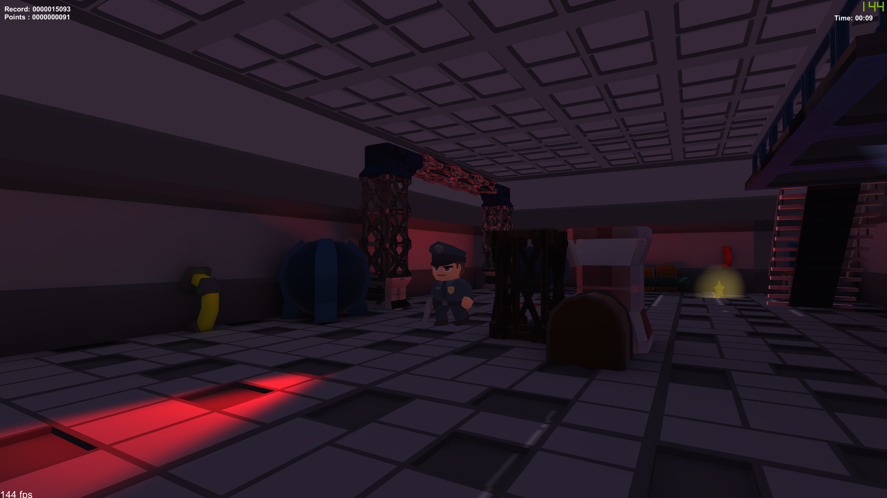
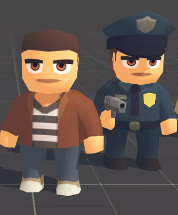
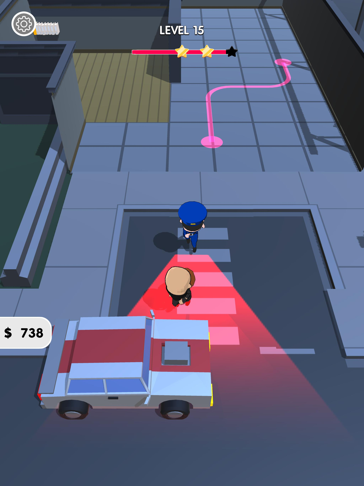
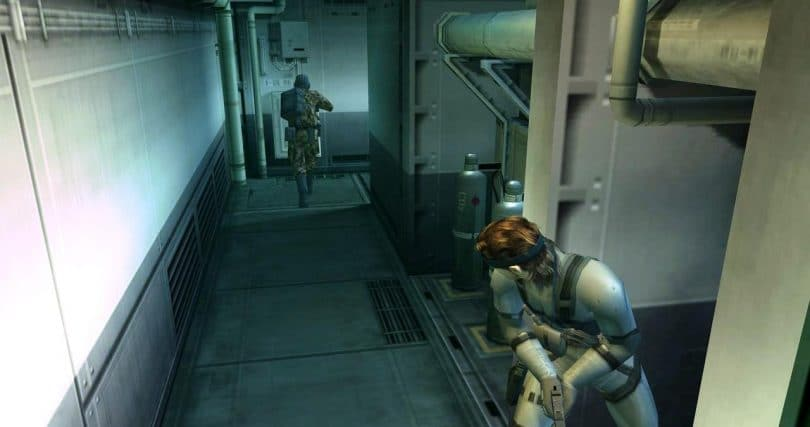

# SINO-game (Stealing Is Not Okay)

 
## Overview
SINO-game is a 3D game developed with unity 3D. The purpose of this game is to collect as many items as possible in the shortest possible time, without getting caught by the cops. 

  

## Main Characters

  

The main characters of the SINO-game are the thief and the policeman. Of thief there is only one, but in the future (since the game is open source) you could think of adding more characters allied to the thief. 
As for the policeman, there could be more than one. This depends on the level. 

## Inspirations
We as SINO-DEVs have been inspired by several games. At first, we didn't want to develop the usual guard-guard game, but wanted to put some inventiveness into it. To do this we based ourselves on 2 main games, namely, Lucky Looter and Meal Gear Solid 2. 

### Lucky Looter

  

### Metal Gear Solid 2

  

## Development

Want to contribute? Great!

Feel free to add/modify features or logic game, levels, characters and so on.

## License
MIT © License SINO-DEVs
